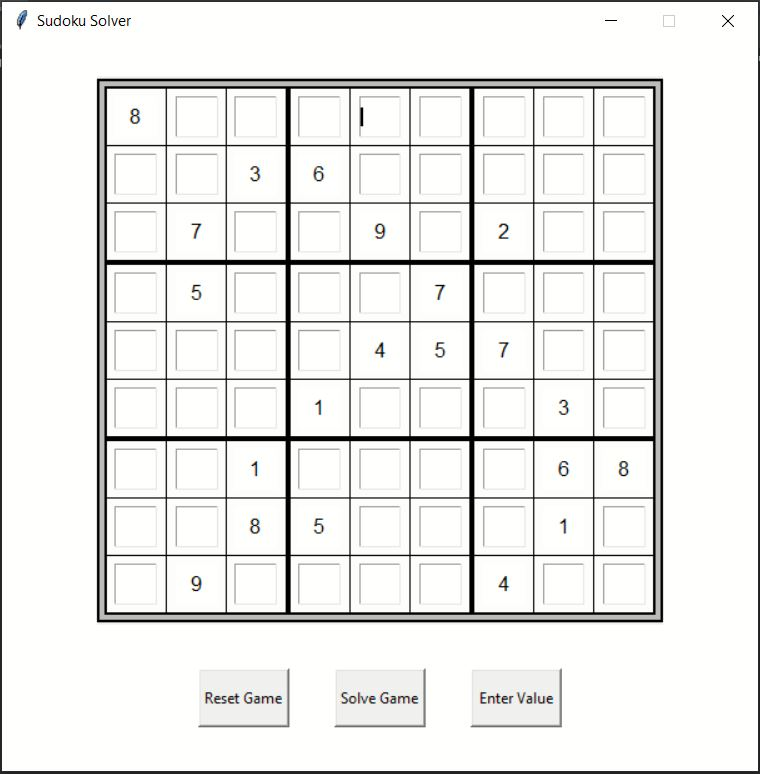

# GUI Sudoku Solver
This is a GUI Sudoku game. It allows the user to try solving the displayed Sudoku puzzle and if you get stuck it will solve the rest for you using a backtrack algorithm. 

# What I Learnt
1- How to implement the backtrack algorithm. 
2- Worked with tkinter to build GUI application. 
3- Used object oriented programming.

# User Instructions
1- Save all contents of the folder "GUI Sudoku Solver" on your computer in the same folder. 
2- Run "Sudoku Solver GUI.py". The GUI window will display as shown below. 

3- Test out the login system by signing up and logging in! Your account will be save when "Exit" is clicked to leave the application.

 
